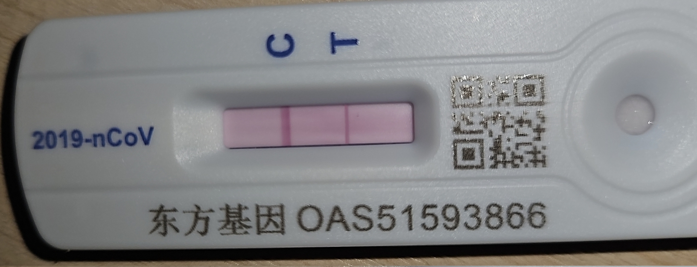

# Toy Compiler

This is a toy compiler of a toy language powered by LLVM . This is a project that I used to kill time when I got crown (for the 3rd time 😅😅😅😅), so it's not a serious project and won't be updated again. 



⚠️⚠️ Since I was feverish🥵 and unable to think straight when coding this, there are a large amount of { 🪲🪲🪲, 🐞🐞🐞, 💩💩💩 and copilot's completion without even being reviewed, etc. } hidden in the codes. 

Try this:

```
extern def printf(fmt: String, ...): Int;

def fibonacci(n: Int): Int {
    if n <= 2 {
        return 1;
    } else {
        return fibonacci(n - 1) + fibonacci(n - 2);
    }
}

def main() {
    let n: Int = 10;
    printf("fibonacci(%d) = %d", n, fibonacci(n));
    return;
}
```

Compiled LLVM IR file.

```
; ModuleID = 'MainModule'
source_filename = "MainModule"

@0 = private unnamed_addr constant [19 x i8] c"fibonacci(%d) = %d\00", align 1

declare i64 @printf(ptr, ...)

define i64 @fibonacci(i64 %n) {
  %1 = icmp sle i64 %n, 2
  br i1 %1, label %2, label %3

2:                                                ; preds = %0
  ret i64 1

3:                                                ; preds = %0
  %4 = sub i64 %n, 1
  %5 = call i64 @fibonacci(i64 %4)
  %6 = sub i64 %n, 2
  %7 = call i64 @fibonacci(i64 %6)
  %8 = add i64 %5, %7
  ret i64 %8
}

define void @main() {
  %n = alloca i64, align 8
  store i64 10, ptr %n, align 4
  %1 = load i64, ptr %n, align 4
  %2 = load i64, ptr %n, align 4
  %3 = call i64 @fibonacci(i64 %2)
  %4 = call i64 (ptr, ...) @printf(ptr @0, i64 %1, i64 %3)
  ret void
}
```